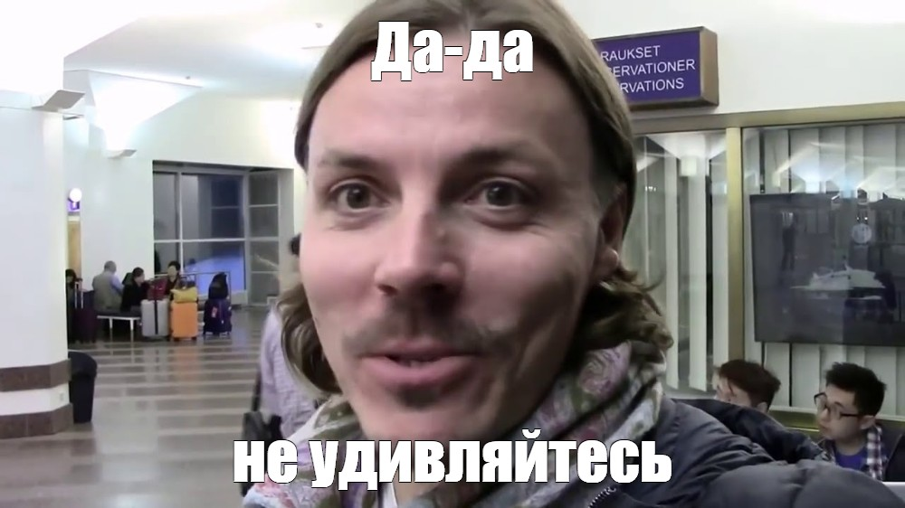

## Обновление дизайна

Да-да, не удивляйтесь. 

На самом деле, данный дизайн - эхо моей вечной войны амбиций и возможностей.
Я часто придумываю что-то, что приводит меня в дикий восторг, но потом застреваю посреди процесса: где-то не хватает знаний, где-то мотивации, а идея, в итоге, остаётся в голове.

---

## Новые функции

Что дальше? Тупа пока идей миллион: хочется накинуть сюда разных фишек, которые будут работать не только ради интереса, но и как портфолио. Типа демонстрации навыков, чтобы блог имел хоть какой-то весомый смысл.

---

## Ну и самое главное

Этот пост просто так тут. Он не несет никакого смысла, мне просто надо было что-то написать

